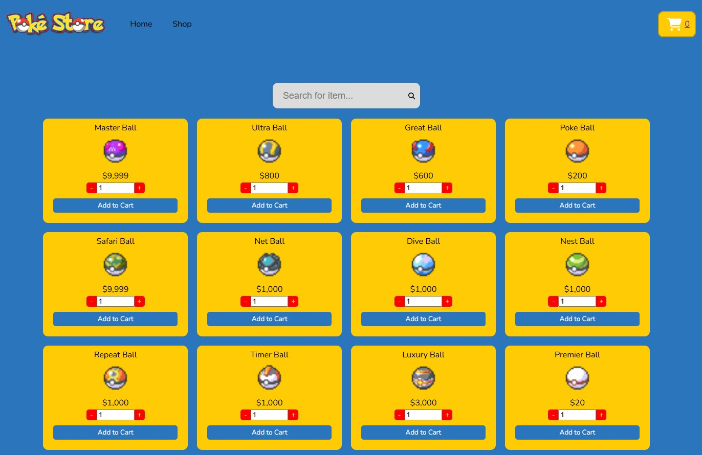

<!-- TABLE OF CONTENTS -->

  
Table of Contents

  <ol>
    <li>
      <a href="#about-the-project">About The Project</a>
      <ul>
        <li><a href="#built-with">Built With</a></li>
      </ul>
    </li>
    <li><a href="#contact">Contact</a></li>
  </ol>

<!-- ABOUT THE PROJECT -->

## About The Project

### [Live Demo](https://julianchso.github.io/shopping-cart-pokemon/)

_(ctrl+click link above to open in new window)_

This app is a pokemon featured store and cart. It helped me with learning React components and how to structure my code.

### Features

- fetches items from the PokéAPI
- add items to cart
- delete items from cart
- basic lookup search bar

### Features to Come (and hurdles to overcome and possible solutions)!

- Storing for items fetched from PokéAPI
  - Since there are a total of 2,229 items (and hundreds of thousands of lines of code in the JSON file), it would not be practical to fetch all data at once. Not only would loading the data take a long time and decrease the user experience, I would also be banned from using pokéAPI.
  - **Possible Solution**: Use node/express to GET the data and store in a MongoDB database.
- Pagination/lazy-loading
  - This feature will allow for a faster user experience while allowing the filter function to filter all items.
- Search items by category
  - This feature will be in the sidebar for quicker navigation of items.

<!-- BUILT WITH -->

### Built With

- 
- 
- 

(<a href="#readme-top">back to top</a>)

<!-- CONTACT -->

## Contact

Julian So: 

Project Link: [https://github.com/julianchso/shopping-cart-pokemon](https://github.com/julianchso/shopping-cart-pokemon)

(<a href="#readme-top">back to top</a>)

